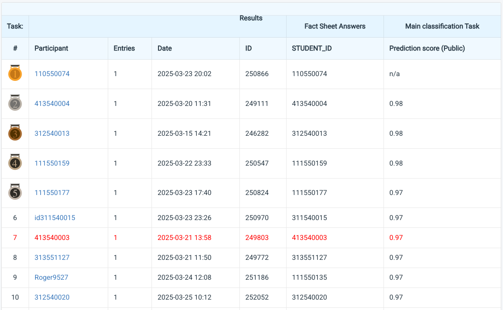

# NYCU Selected Topics in Visual Recognition using Deep Learning 2025 Spring HW1

**Student ID:** 413540003

**Name:** Dao Cong Tinh (桃公信)

## Introduction

In this homework, I used the SE-ResNeXt-D (Rectangle-2 Anti-Aliasing) [^1][^2][^3][^4][^5][^6] - image classification model with Squeeze-and-Excitation (SE) channel attention. The method outlines a deep convolutional neural network (CNN) based on the ResNet structure. It incorporates several advanced components to enhance the model's capability in image classification tasks. The core architecture consists of several layers, each including bottleneck blocks. These bottlenecks are composed of convolutional layers with batch normalization and ReLU activation functions, facilitating deep feature learning while reducing computational complexity. Notably, the network uses a "group convolution" mechanism in intermediate layers, which reduces the number of parameters while maintaining performance. Additionally, a significant innovation is the incorporation of a SE module in each bottleneck. This module dynamically adjusts the feature maps based on global information, thus improving the representational power of the network. The architecture also includes adaptive pooling and a fully connected output layer, which ultimately produces predictions for a set of 100 classes. This combination of techniques is designed to improve model performance, reduce overfitting, and allow efficient learning in terms of image classification tasks.

---

## How to Install

The environment was managed using Conda 4.14.0, with the following main dependencies:
- Python==3.10.16
- PyTorch==2.5.1+cu124
- Torchvision==0.15.2+cu124
- Timm==1.0.15
- Pandas==2.2.3

To create and install the Conda environment named "**VRDL__HW1**" with the above required dependencies, run the following commands:
```bash
# Create a conda environment
conda create --name VRDL__HW1 python==3.10.16
conda activate VRDL__HW1

# Install dependencies
conda install pytorch==2.5.1+cu124 torchvision==0.15.2+cu124 \
              timm==1.0.15 pandas==2.2.3

python 413540003.py \
  --model seresnextaa101d_32x8d.sw_in12k_ft_in1k \
  --n_epoch 30 \
  --batch_size 32 \
  --lr 0.001 \
  --optimizer adagrad \
  --scheduler cosine \
  --loss label_cross_entropy \
  --clip 1.0 \
  --pretrained
```
## Performance snapshot


## References
[^1]: R. Wightman, "Pytorch image models," https://github.com/huggingface/pytorch-image-models, 2019.

[^2]: S. Xie, R. Girshick, P. Doll´ar, Z. Tu, and K. He, "Aggregated residual transformations for deep neural networks," arXiv preprint arXiv:1611.05431, 2016.

[^3]: R. Zhang, "Making convolutional networks shift-invariant again," in ICML, 2019.

[^4]: K. He, X. Zhang, S. Ren, and J. Sun, "Deep residual learning for image recognition," arXiv preprint arXiv:1512.03385, 2015.

[^5]: J. Hu, L. Shen, and G. Sun, "Squeeze-and-excitation networks," 2018.

[^6]: T. He, Z. Zhang, H. Zhang, Z. Zhang, J. Xie, and M. Li, "Bag of tricks for image classification with convolutional neural networks," 2019 IEEE/CVF Conference on Computer Vision and Pattern Recognition (CVPR), pp. 558–567, 2018.