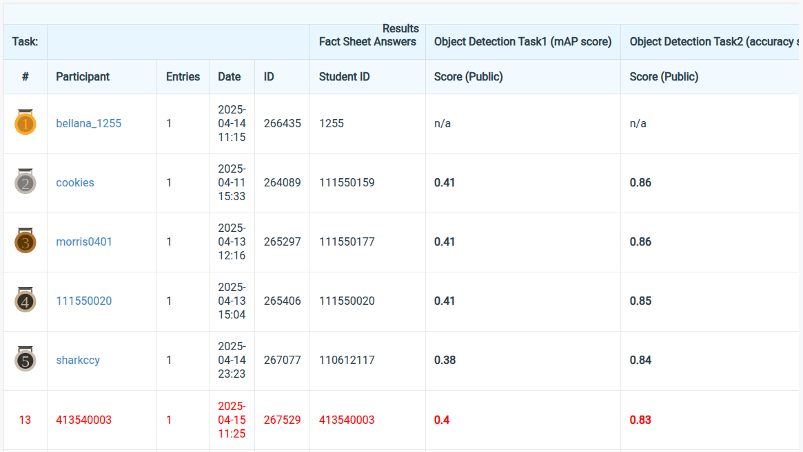

# NYCU Selected Topics in Visual Recognition using Deep Learning 2025 Spring HW2

**Student ID:** 413540003

**Name:** Dao Cong Tinh (桃公信)

## Introduction

In this homework, we will address the task of digit recognition using deep learning techniques, specifically focusing on the application of Faster R-CNN for detecting and classifying digits in images. The goal of this homework is separated into 2 tasks: **Task 1** requires detecting individual digits in images and identifying their corresponding bounding boxes, while **Task 2** involves recognizing the entire number by interpreting the detected digits. To tackle these tasks, I employ Faster R-CNN, an object detection model that consists of a **backbone** for feature extraction, a **neck** region proposal network (RPN) for generating candidate bounding boxes, and a **head** for classifying these proposals into predefined categories. Our approach includes preprocessing the data to ensure it is in the correct format, followed by the application of Faster R-CNN for digit detection and classification. Additionally, the proposed model is a modified version of **Faster R-CNN [^1] with a Cross-Stage-Partial-based (CSP) [^2][^3][^4][^5] Backbone**. The architecture is built upon the standard Faster R-CNN model, but with the backbone replaced by the CSPWithFPN network to better capture feature hierarchies for digit recognition tasks. It's structured for digit recognition tasks with initial weights trained on ImageNet.


---

## How to Install

The environment was managed using Conda 4.14.0, with the following main dependencies:
- Python==3.10.16
- PyTorch==2.5.1+cu124
- Torchvision==0.15.2+cu124
- Timm==1.0.15
- Numpy==1.26.4
- Pandas==2.2.3
- Pillow==11.1.0

To create and install the Conda environment named "**VRDL__HW2**" with the above required dependencies, run the following commands:
```bash
# Create a conda environment
conda create --name VRDL__HW2 python==3.10.16
conda activate VRDL__HW2

# Install dependencies
conda install pytorch==2.5.1+cu124 torchvision==0.15.2+cu124 \
              timm==1.0.15 pandas==2.2.3 numpy==1.26.4 pillow==11.1.0

python run.py \
  --backbone CSPWithFPN \
  --epochs 24 \
  --batch_size 4 \
  --lr 0.0001 \
  --optimizer adam \
  --scheduler multi_step
```
## Performance snapshot


## References
[^1]: Ren, S., He, K., Girshick, R., & Sun, J. (2015). Faster r-cnn: Towards real-time object detection with region proposal networks. Advances in neural information processing systems, 28.

[^2]: Wang, C. Y., Liao, H. Y. M., Wu, Y. H., Chen, P. Y., Hsieh, J. W., & Yeh, I. H. (2020). CSPNet: A new backbone that can enhance learning capability of CNN. In Proceedings of the IEEE/CVF conference on computer vision and pattern recognition workshops (pp. 390-391).

[^3]: He, K., Zhang, X., Ren, S., & Sun, J. (2016). Deep residual learning for image recognition. In Proceedings of the IEEE conference on computer vision and pattern recognition (pp. 770-778).

[^4]: Wightman, R., Touvron, H., & Jégou, H. (2021). Resnet strikes back: An improved training procedure in timm. arXiv preprint arXiv:2110.00476.

[^5]: Wightman, R. (2019). Pytorch image models, https://github.com/huggingface/pytorch-image-models.