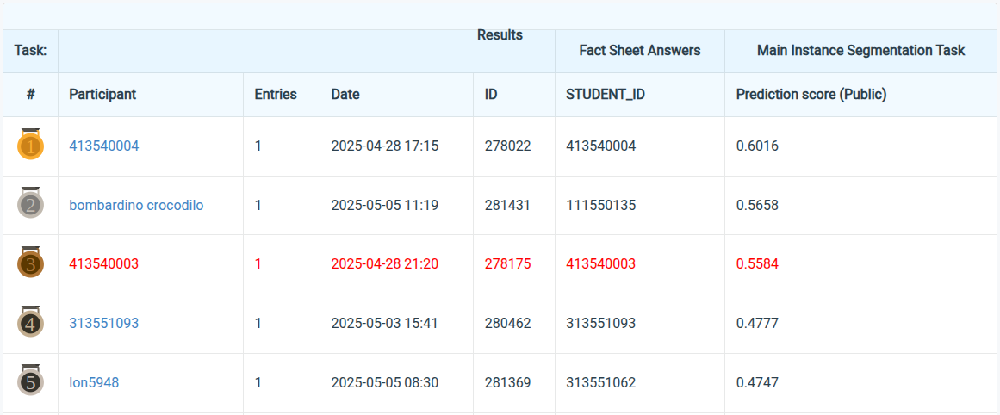

# NYCU Selected Topics in Visual Recognition using Deep Learning 2025 Spring HW3

**Student ID:** 413540003

**Name:** Dao Cong Tinh (桃公信)

## Introduction

In this homework, we will address the task of **instance segmentation** using **Mask R-CNN** to detect and segment four types of cells from colored medical images. The dataset includes 209 training and validation samples and 101 test samples, with each image paired with pixel-level instance masks. We adopt a variant of Mask R-CNN using a **ResNet-50** backbone with **DC5 dilation** ([mask\_rcnn\_R\_50\_DC5\_3x](https://github.com/facebookresearch/detectron2/blob/main/configs/COCO-InstanceSegmentation/mask_rcnn_R_50_DC5_3x.yaml)[^1][^2] from Detectron2[^3]) strategy to expand the receptive field in its final stage. Unlike the Feature Pyramid Network (FPN)-based architecture, DC5 maintains a higher-resolution feature map from the deepest layers, which is especially beneficial for dense and fine-grained tasks such as cell segmentation. The architecture includes dedicated heads for bounding box regression, object classification, and mask prediction. To accelerate convergence and improve performance, the model is initialized with **ImageNet** pre-trained weights. Before training, the raw .tif images and corresponding segmentation masks are preprocessed to match the model input format and align with evaluation requirements.


---

## Repository structure
    .
    ├──nycu-hw3-data/
    |   ├──test/
    |   ├──train/
    |   ├──test_image_name_to_ids.json
    |   └──train__annot.json
    ├──tensorboard/
    ├──annotation.py
    ├──inference.py
    ├──README.md
    ├──train.py
    ├──trainer.py
    ├──utils.py
    └──train.py

## How to Install

The environment was managed using Conda 4.14.0, with the following main dependencies:
- Python==3.10.16
- PyTorch==2.5.1+cu124
- Torchvision==0.15.2+cu124
- Numpy==1.26.4
- Pycocotools==2.0.8
- Detectron2==0.6 ([Installation](https://detectron2.readthedocs.io/en/latest/tutorials/install.html))
- Scikit-image==0.24.0
- Opencv-python==4.11.0.86

To create and install the Conda environment named "**VRDL__HW3**" with the above required dependencies, run the following commands:
```bash
# Create a conda environment
conda create --name VRDL__HW3 python==3.10.16
conda activate VRDL__HW3

# Install dependencies
conda install pytorch==2.5.1+cu124 torchvision==0.15.2+cu124 numpy==1.26.4 \
              pycocotools==2.0.8 scikit-image==0.24.0 opencv-python==4.11.0.86
# Need to install Detectron2...

python train.py \
  --model mask_rcnn_R_50_DC5_3x \
  --epochs 225 \
  --batch_size 14 \
  --lr 0.001 \
  --optimizer Adagrad \
  --scheduler WarmupCosineLR
```
## Performance snapshot


## References
[^1]: He, K., Gkioxari, G., Dollár, P., & Girshick, R. (2017). Mask r-cnn. In Proceedings of the IEEE international conference on computer vision (pp. 2961-2969).

[^2]: Y. Wu, A. Kirillov, F. Massa, W.-Y. Lo, and R. Girshick, "Detectron2," https://github.com/facebookresearch/detectron2, 2019.

[^3]: He, K., Zhang, X., Ren, S., & Sun, J. (2016). Deep residual learning for image recognition. In Proceedings of the IEEE conference on computer vision and pattern recognition (pp. 770-778).