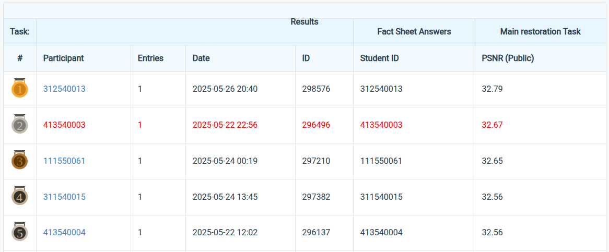

# NYCU Selected Topics in Visual Recognition using Deep Learning 2025 Spring HW4

**Student ID:** 413540003

**Name:** Dao Cong Tinh (桃公信)

## Introduction

In this homework, we address the task of **image restoration** using a **prompt-based Transformer architecture**[^1] called **PromptIR**[^2]. The model is capable of handling various degradations — such as **deraining** and **desnowing** — with minimal prior knowledge. 

[PromptIR](https://github.com/va1shn9v/PromptIR)[^3] uses a hierarchical encoder-decoder Transformer design enriched with task-specific **learnable prompts** to guide restoration at different feature levels. The architecture incorporates residual connections, channel attention, and multi-level prompting to improve restoration accuracy.


---

## Repository structure
  .
  ├── data_split/                   # Training and validation data
  │   ├── Test/
  │   ├── Train/
  │   │   ├── Derain/
  │   │   │   ├── gt/
  │   │   │   ├── rainy/
  │   │   │   └── rain.txt
  │   │   └── Desnow/
  │   │       ├── gt/
  │   │       ├── snowy/
  │   │       └── snow.txt
  │   └── Valid/
  │       ├── Derain/
  │       │   ├── gt/
  │       │   ├── rainy/
  │       │   └── rain.txt
  │       └── Desnow/
  │           ├── gt/
  │           ├── snowy/
  │           └── snow.txt
  ├── utils/
  │   ├── image_utils.py           # Augmentation and cropping
  │   ├── image_io.py              # Saving images
  │   ├── dataset_utils.py         # Datasets for train/test
  │   ├── val_utils.py             # PSNR metric
  ├── net/
  │   └── model.py                 # PromptIR architecture
  ├── train_ckpt/                  # Model checkpoints
  ├── logs/                        # TensorBoard logs
  ├── train.py                     # Training pipeline
  ├── inference.py                 # Inference and test output
  ├── options.py                   # Configs and hyperparameters
  └── README.md

## How to Install

The environment was managed using Conda 4.14.0, with the following main dependencies:
- Python==3.10.16
- PyTorch==2.5.1+cu124
- Torchvision==0.15.2+cu124
- Numpy==2.0.2
- Pillow==11.0.0
- Einops==0.8.1
- Scikit-image==0.24.0
- Lightning=2.5.1.post0

To create and install the Conda environment named "**VRDL__HW4**" with the above required dependencies, run the following commands:
```bash
# Create a conda environment
conda create --name VRDL__HW4 python==3.10.16
conda activate VRDL__HW4

# Install dependencies
conda install pytorch==2.5.1+cu124 torchvision==0.15.2+cu124 numpy==2.0.2 \
              pillow==11.0.0 einops==0.8.1 scikit-image==0.24.0 \
              lightning=2.5.1.post0

# For training
python train.py \
  --cuda 0 \
  --epochs 200 \
  --batch_size 6 \
  --lr 0.0002 \
  --de_type derain desnow \
  --patch_size 128
# Training parameters are defined in `options.py`.

# For inference
python inference.py \
  --cuda 0 \
  --test_path ./data_split/Test/ \
  --ckpt_dir ./train_ckpt/ \
  --ckpt_name best-model.ckpt
```
## Performance snapshot


## References
[^1]: Vaswani, A., Shazeer, N., Parmar, N., Uszkoreit, J., Jones, L., Gomez, A. N., ... & Polosukhin, I. (2017). Attention is all you need. Advances in neural information processing systems, 30.

[^2]: Potlapalli, V., Zamir, S. W., Khan, S. H., & Shahbaz Khan, F. (2023). Promptir: Prompting for all-in-one image restoration. Advances in Neural Information Processing Systems, 36, 71275-71293.

[^3]: https://github.com/va1shn9v/PromptIR